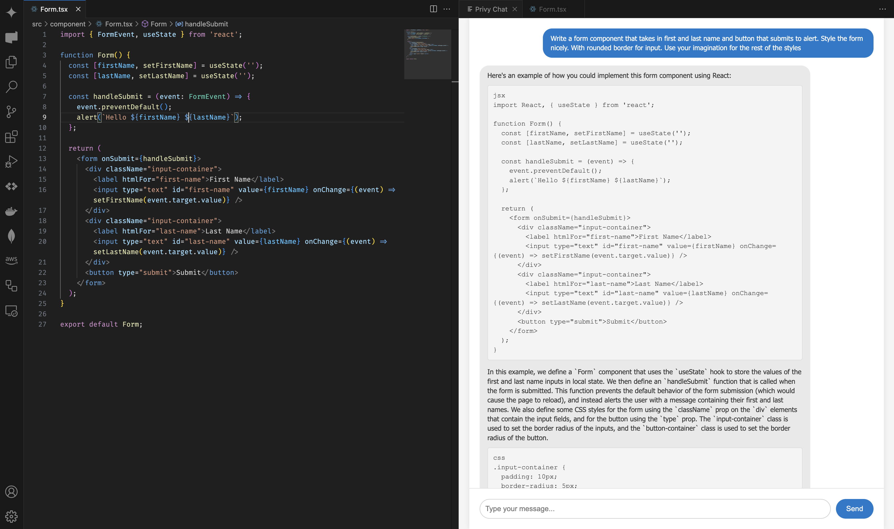

# privy README

This is the README for your extension "privy". After writing up a brief description, we recommend including the following sections.

## Features

Privy is a locally-hosted AI assistant designed to enhance the coding experience in Visual Studio Code. By leveraging advanced large language models (LLMs), this tool provides intelligent code suggestions, autocompletions, and insights, all while ensuring complete data privacy and security by running entirely on your local machine.

After you run the app locally, you should see a screen open on the either right or left of your vscode.

> Tip: Many popular extensions utilize animations. This is an excellent way to show off your extension! We recommend short, focused animations that are easy to follow.

## Requirements

This extension requires ollama. Ollama is a tool that serves open sources like llama3.1, codellama, mistrial, and many more. 

- Install Ollama and run ollama run/pull LLM_OF_INTEREST. (this project uses codeollama/llama3.1 etc) You can choose your own poison.

## Extension Settings

Include if your extension adds any VS Code settings through the `contributes.configuration` extension point.

For example:

This extension contributes the following settings:

* `myExtension.enable`: Enable/disable this extension.
* `myExtension.thing`: Set to `blah` to do something.

## Known Issues

Calling out known issues can help limit users opening duplicate issues against your extension.

## Release Notes

Users appreciate release notes as you update your extension.

### 1.0.0

Initial release of ...

### 1.0.1

Fixed issue #.

### 1.1.0

Added features X, Y, and Z.

---

## Following extension guidelines

Ensure that you've read through the extensions guidelines and follow the best practices for creating your extension.

* [Extension Guidelines](https://code.visualstudio.com/api/references/extension-guidelines)

## Working with Markdown

You can author your README using Visual Studio Code. Here are some useful editor keyboard shortcuts:

* Split the editor (`Cmd+\` on macOS or `Ctrl+\` on Windows and Linux).
* Toggle preview (`Shift+Cmd+V` on macOS or `Shift+Ctrl+V` on Windows and Linux).
* Press `Ctrl+Space` (Windows, Linux, macOS) to see a list of Markdown snippets.

## For more information

* [Visual Studio Code's Markdown Support](http://code.visualstudio.com/docs/languages/markdown)
* [Markdown Syntax Reference](https://help.github.com/articles/markdown-basics/)

**Enjoy!**
